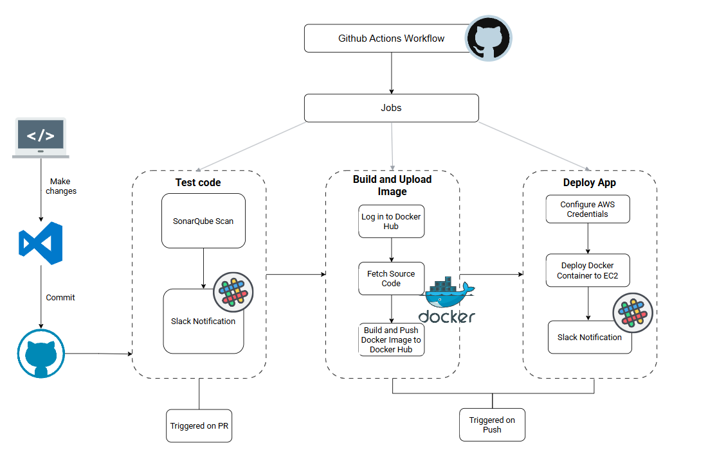

# GitHub Actions CI/CD Workflow

## Description

Automated CI/CD pipeline that scans code quality,
builds a Docker image and deploys Docker container to AWS EC2.

## Flow

**Pull request to Main:**

- SonarQube tests the code quality
- Slack notification sent on completion of scan

**Push to Main:**

- Log in to DockerHub
- Docker builds image and pushes it to DockerHub
- Configuration of AWS Credentials and deployment of Docker container to EC2
- Slack notification sent on completion of deployment

## Technologies used

- Github Actions - CI/CD automation
- DockerHub - Image registry
- Docker - Containerization
- Slack - notifications
- AWS EC2 - application hosting
- SonarQube - code quality analysis

## Structure

├── .github/
│ └── workflows/
│ └── pipeline.yaml
├── app/
│ ├── app.py
│ ├── requirements.txt
│ └── Dockerfile
└── sonar-project.properties

## Prerequisites

- AWS EC2 instance with Docker installed
- SonarQube server running
- Docker Hub account
- Slack webhook configured

## Secrets Required

- DOCKERHUB_TOKEN
- EC2_SSH_PRIVATE_KEY
- EC2_URL
- EC2_USERNAME
- SONAR_TOKEN
- SONAR_HOST_URL
- SLACK_WEBHOOK_URL
- AWS_ACCESS_KEY_ID
- AWS_SECRET_ACCESS_KEY
